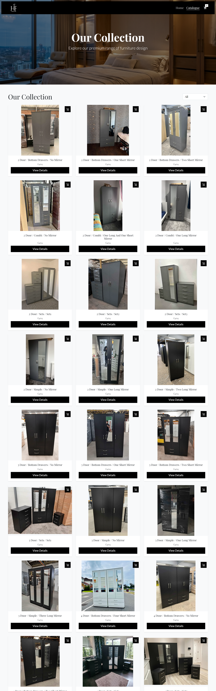

# HF-Furniture Collection



A static showroom and catalogue site for HF-Furniture. The project includes a landing page, filtered catalogue, product detail pages, a cart flow with finish selection, and WhatsApp checkout.

## Current Features

- Landing page in `home.html` with hero carousel, category section, features, FAQ, and newsletter block
- Catalogue page in `index.html` with category filtering
- Product cards with image carousels across 4 finishes: Black, White, Grey, and Oak
- Product detail page in `product.html` with finish switching, dimensions, and related products
- Cart page in `cart.html` with quantity controls, per-finish items, totals, and WhatsApp checkout
- Finish selection modal that previews the actual wardrobe image in each finish
- Shared image fallback handling through `js/image-fallback.js`
- Local devtool shield through `js/wall.js` with an optional client-side protection layer in `js/protect.js`
- Owner gateway in `gateway.html` to temporarily disable protection on the current browser
- Responsive layout for desktop, tablet, and mobile

## Project Structure

```text
catalogue/
|-- home.html
|-- index.html
|-- product.html
|-- cart.html
|-- gateway.html
|-- css/
|   |-- style.css
|-- js/
|   |-- app.js
|   |-- cart.js
|   |-- data.js
|   |-- description.js
|   |-- image-fallback.js
|   |-- protect.js
|   |-- transition.js
|   |-- wall.js
|-- pics/
|   |-- logo.webp
|   |-- logo2.webp
|   |-- hero-1.webp
|   |-- hero-2.webp
|   |-- hero-3.webp
|   |-- hero-4.webp
|   |-- fallback.webp
|   |-- black.webp
|   |-- white.webp
|   |-- grey.webp
|   |-- readme/
|-- black/
|-- white/
|-- grey/
|-- oak/
`-- docs/
```

## How Product Images Work

Each product in `js/data.js` uses a `relativePath`, for example:

```js
{
    relativePath: "2 door/simple/no mirror.webp",
    name: "2 door / simple / no mirror",
    category: "2 door",
    price: 404
}
```

That path is resolved against each finish folder:

- `black/2 door/simple/no mirror.webp`
- `white/2 door/simple/no mirror.webp`
- `grey/2 door/simple/no mirror.webp`
- `oak/2 door/simple/no mirror.webp`

If you add a product, the same `relativePath` must exist inside every finish folder you want to display.

## Main Files

- `home.html`: landing page and marketing sections
- `index.html`: main catalogue grid and filtering UI
- `product.html`: single product view
- `cart.html`: checkout/cart experience
- `gateway.html`: owner-only activation page for disabling client-side protection
- `js/data.js`: product list, dimensions, finish options, and image-path helpers
- `js/app.js`: catalogue rendering and filtering
- `js/cart.js`: cart rendering, quantity logic, finish modal, and WhatsApp checkout
- `js/description.js`: product descriptions
- `js/wall.js`: local devtool-detection library used by protected pages
- `js/protect.js`: client-side protection and owner bypass logic
- `css/style.css`: site styling for all pages

## Running the Project

You can open the site directly in a browser by starting from `home.html` or `index.html`.

For a cleaner local workflow, run a simple local server:

```bash
python -m http.server 8000
```

Then open:

```text
http://localhost:8000
```

## Updating Content

### Add or Edit Products

Update `js/data.js` and make sure the image exists in the finish folders.

### Update Product Copy

Edit `js/description.js`.

### Change Layout or Styling

Edit `css/style.css`.

### Update Cart or Checkout Behavior

Edit `js/cart.js`.

## Protection Notes

`js/wall.js` redirects protected pages to `404.html` when developer tools are detected.

`js/protect.js` handles the owner bypass flow and blocks casual actions like right-click, copy shortcuts, and image dragging.

The owner bypass is activated through `gateway.html` and stored in the browser for a limited time.

Important:

- This is a static site, so protection is deterrence only
- The owner activation code is still client-side
- Do not treat this as real security

## Contact

- Facebook: https://www.facebook.com/hf.furniture.co.uk
- Instagram: https://www.instagram.com/hf.furniture.ltd/
- Pinterest: https://uk.pinterest.com/hffurniturescouk/
- WhatsApp: https://wa.me/447476748064
- WhatsApp: https://wa.me/447846689490

## License

Copyright 2025 HF-Furniture Collection. All rights reserved.
